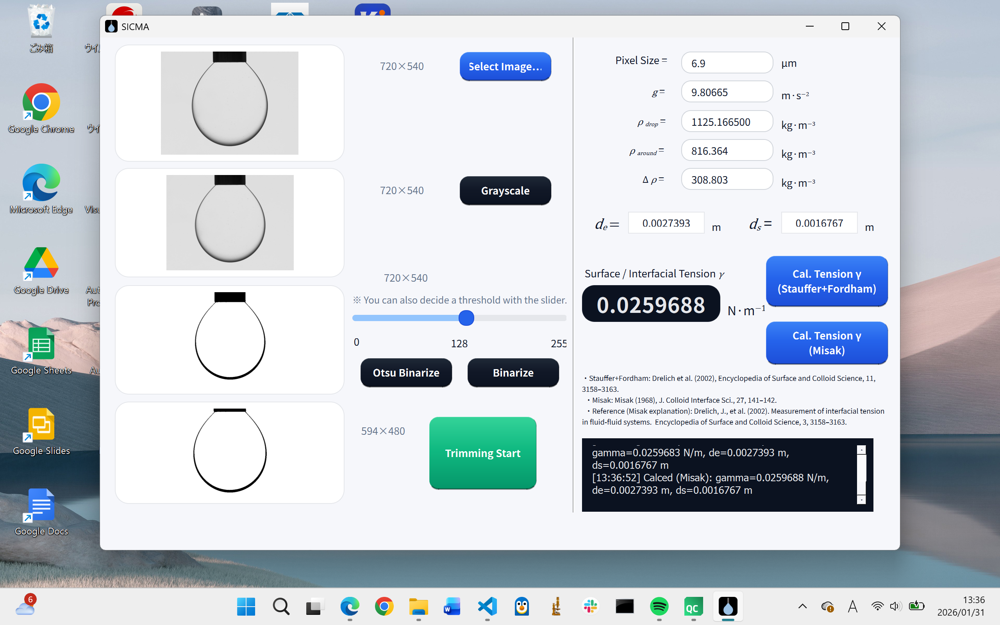

# SICMA — Interfacial/Surface Tension Calculator (Pendant Drop, de–ds method)



Qt (C++) で作った、画像から液滴の **de（最大径）** と **ds（指定位置の径）** を抽出し、de–ds 法で **界面張力 / 表面張力 γ [N/m]** を計算するアプリです。  
二値化（スライダー閾値 or 大津法）→ トリミング → 計算、の流れで使います。

---

## Features

- 画像表示（カラー / グレースケール / 二値化 / トリミング後）
- 二値化
  - 手動閾値（スライダー）
  - **Otsu（大津の方法）自動閾値**
- トリミング（ROIを切り出して液滴領域だけで計算）
- de–ds 法による界面張力計算（方式切替）
  - **Stauffer + Fordham（テーブル補間）**
  - **Misak（区間ごとの経験式係数）**
- ログ表示（GUI内）

---

## UI / Workflow

1. **Select Image**  
2. **Gray Scale**  
3. 二値化  
   - **Otsu Binarize**（推奨）または **Slider + Binarize**
4. **Trimming Start** → 液滴領域を切り出し
5. パラメータ入力  
   - Pixel Size [μm]  
   - g [m/s²]  
   - ρ_drop / ρ_around → Δρ [kg/m³]（自動計算）
6. 計算ボタン  
   - **Cal. Tension (Stauffer+Fordham)**
   - **Cal. Tension (Misak)**

---

## Parameters / Units

- Pixel Size: **μm/pixel（UI入力）**  
  内部では **m/pixel** に変換して計算します（`pix_m = pix_um * 1e-6`）。
- g: **m/s²**
- Δρ: **kg/m³**
- de, ds: **m**
- γ: **N/m**（表示も N/m）

---

## Methods

本ソフトは **de–ds method**（pendant drop）を用いて、

\[
\gamma = \Delta\rho \, g \, d_e^2 \cdot \left(\frac{1}{H(S)}\right), \quad S = \frac{d_s}{d_e}
\]

を計算します。  
ここで \( 1/H(S) \) の取り方を 2方式実装しています。

### 1) Stauffer + Fordham (Table Interpolation)
- wide形式のテーブル `stauffer_invH_wide.dat`, `fordham_invH_wide.dat` を読み込み
- S に対して線形補間で \(1/H\) を取得

### 2) Misak (Piecewise empirical constants)
- `misak_invH_constants.dat` を読み込み
- Sの区間に応じて経験式から \(1/H\) を計算

---

## References (for QLabel)

```
Stauffer+Fordham:
Drelich et al. (2002), Encyclopedia of Surface and Colloid Science, 11, 3158–3163.
Good, R. (Ed.). (2012). Surface and Colloid Science: Volume 11: Experimental Methods. Springer Science & Business Media.

Misak:
Misak (1968), J. Colloid Interface Sci., 27, 141–142.

Reference (Misak explanation):
Drelich, J., Fang, C., & White, C. L. (2002). Measurement of interfacial tension in fluid-fluid systems.
Encyclopedia of Surface and Colloid Science, 3, 3158–3163.
```

---

## Data files

次の係数ファイルが必要です（例: `data/` フォルダ or Qt Resource `:/data/`）。

- `stauffer_invH_wide.dat`
- `fordham_invH_wide.dat`
- `misak_invH_constants.dat`

※ パス探索は以下の優先順で行われる想定：
1. `<app>/data/`
2. `./data/`（実行時カレント）
3. `:/data/`（Qt Resource）

---

## Build

### Requirements
- Qt 6.x（Qt Widgets）
- C++17 推奨

### Example (Qt Creator)
1. Qt Creator で `.pro` / `CMakeLists.txt` を開く  
2. Build → Run

---

## Notes / Tips

- 入力画像は、**背景が明るく、液滴が黒（0）で抽出できる**二値化結果になるようにしてください。
- Otsu 二値化がうまくいかないときは、スライダーで閾値を調整してから `Binarize` を試してください。
- ds/de の範囲外（例: S < 0.30, S >= 0.999）ではエラーになります。

---

## License

This project is licensed under the **MIT License** — see the `LICENSE` file for details.

---

## Author

**Mitsuki ISHIYAMA**
